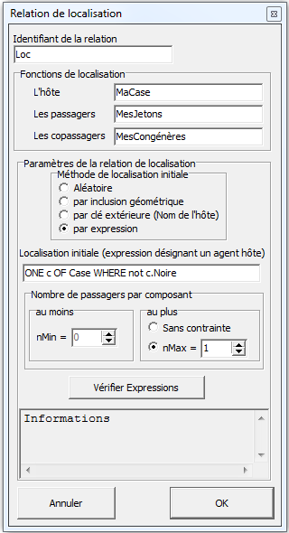

== L’interface de modélisation

La fenêtre de modélisation est celle dans laquelle est construit le modèle conceptuel, sous une forme arborescente composée d’entités et de relations. La méthode de construction d’un modèle consiste à ajouter des organisations à l’agent modèle (et aux agents en général), organisations qui contiennent elles-mêmes des classes d’agents composants. Puis on ajoute des relations entre classes agent. Vient ensuite la mise en place des comportements. A ce niveau on travaille de manière uniquement graphique, sans entrer dans les détails internes (sauf pour changer éventuellement leur nom), chaque entité conceptuelle étant concrétisée par un symbole graphique particulier et les relations par des flèches et des lignes entre ces entités.

=== La symbolique des entités et des relations du modèle conceptuel

Les entités d’un modèle conceptuel sont construites selon la symbolique suivante :

.Entités du modèle conceptuel  :
====
|===
| Type d'entité | Symbole graphique
| Agent unique | image:/assets/image004.jpg[alt=""]
| Agent générique | image:/assets/image006.jpg[alt=""]
| Comportement simple | image:/assets/image007.png[alt=""]
| Comportement sous forme de diagramme de transition | image:/assets/image008.png[alt=""]
| Organisation sociale (Population) | image:/assets/image010.jpg[alt=""]
| Organisation spatiale | image:/assets/image012.jpg[alt=""]
|===
====

Les relations entre entités graphiques sont construites selon la symbolique suivante :

.Relations du modèle conceptuel  :
====

|===
| Type de relation | Définition | Symbolique

| Appronfondissement | `Agent -> Organisation` | image:/assets/image014.jpg[alt=""]

| Composition | `Organisation -> Agent` | image:/assets/image016.png[alt=""]

| Localisation | `Agent -> Agent` | image:/assets/image020.jpg[alt=""]

| Localisation étendue | `Agent -> (Agent, ... , Agent)` |image:/assets/image022.jpg[alt=""]

|===

====

=== Principe de construction d’un modèle dans MAGEO

La seule entité présente par défaut lors de la création d’un nouveau modèle est l’agent unique « Modèle ». Un clic droit sur cette entité, et sur toute entité en général, permet d’afficher un menu contextuel (voir Figure 2) qui contient toutes les possibilités pour compléter le modèle, c’est-à-dire ajouter des organisations, des comportements et diverses relations. Un simple clic (bouton gauche) sur une entité permet de la sélectionner, un double-clic permet d’entrer dans l’entité sélectionnée, c’est-à-dire d’afficher son dialogue de paramétrage.

image:/assets/image024.jpg[alt="Menu contextuel associé à un type d'entité (ici un agent)"]

En utilisant les choix proposés par ce menu, puis après le positionnement et le dimensionnement des différentes entités créées, le modèle conceptuel se construit progressivement. La Figure 4 illustre un modèle conceptuel complet.

image:/assets/image026.jpg[alt="Exemple de modèle conceptuel"]

=== Paramétrage des entités conceptuelles

Les organisations et les classes d’agents créées sont ensuite renseignées afin de donner des informations qui seront utilisées lors de l’instanciation des entités physiques.

==== Paramétrage des agents

Un agent possède des attributs et un programme d’action. Celui-ci est un script qui indique comment ses différents comportements seront exécutés lors d’un pas de temps. Un agent peut aussi possèder un système interne formé de différentes organisations. Pour gérer son système interne, une liste de ces organisations indique leur ordonnancement lors de l’initialisation et de l’exécution. 

image::/assets/image027.png[align="center", caption="Dialogue de paramétrage d'un agent"]

L’interface de dialogue d’une classe agent permet de définir le contenu et la dynamique des agents. Elle contient :

-  Un identifiant générique de classe, qui sert à définir les identifiants des instances en ajoutant à ce nom un numéro d’ordre ;

- Une liste d’attributs, qui représentent l’état de l’agent ;

- La définition du programme d’action, qui précise l’ordonnancement des comportements de l’agent lors d’un pas de temps, au moyen d’un langage dédié (voir 5.3.4.) ;

- L’ordonnancement des organisations internes, qui indique l’ordre dans lequel seront exécutés les comportements des agents internes lors d’un pas de temps (voir 5.3.2).

Les attributs d’une classe agent doivent être définis dans le tableau des attributs de cette classe. Cette définition consiste à renseigner les 4 champs suivants :

- Le nom de cet attribut ;

- Le type de cet attribut, qui peut être un nombre entier, un nombre décimal, un nombre logique (nombre décimal entre 0 et 1), une chaîne de caractères, un vecteur, un agent, ou un énuméré. Dans MAGéo, une règle fondamentale est qu’un nom d’attribut ne peut être utilisé dans plusieurs classes agents que si le type associé est le même.

- L’expression d’initialisation, écrite en langage MAGéo, qui sera évaluée à l’initialisation du modèle pour fournir la valeur initiale de l’attribut. Cette expression doit donc être du type indiqué dans la colonne précédente. Par exemple, un attribut entier peut prendre une valeur initiale aléatoire entre 0 et 100 par `RandInt(0, 100)`.

- L’expression de la dynamique de cet attribut, également écrite en langage MAGéo, est une expression donnant une nouvelle valeur à l’attribut, et qui sera évoquée lors d’un pas de temps si elle est indiquée dans le programme d’action à l’aide de la fonction `Calc()`. Par exemple, pour que l’attribut Age soit incrémenté à chaque itération, on peut écrire `Age+1` dans le champ de dynamique de cet attribut, et l’invoquer en écrivant `Calc(Age)` dans le programme d’action.

==== Paramétrage des organisations

MAGéo propose actuellement 3 types d’organisations spatiales prédéfinies :

- Les *maillages réguliers* en carrés ou en hexagones ;

- Les *maillages irréguliers* qui permettent de réaliser des cartes zonales topologiques ;

- Les réseaux.

MAGéo propose également 2 types d’organisations sociales :

- Les organisations constituées d’une population générique ;

- Les organisations compartimentées.

Une organisation ayant pour rôle de définir la structure unifiant une collection d’agents, appelés composants de l’organisation, et de gérer les interactions entre ces composants, tous les types d’organisation contiennent :

- Un identifiant générique de classe d’organisation, qui sert à définir les identifiants des instances d’organisation, si besoin en ajoutant à ce nom un numéro d’ordre ;

- La méthode d’instanciation de ses agents composants, qui définit le nombre d’agents à créer ;

- La méthode d’initialisation de ses agents composants qui peut-être directe (une expression par exemple) ou réalisée à partir d’un fichier contenant une table attributaire ;

- La méthode d’ordonnancement de ses agents composants. Elle peut être synchrone (les agents s’exécutent en parallèle), asynchrone (ils s’exécutent selon une séquence dont l’ordre est tiré au hasard) ou selon un ordre défini par une expression dépendant de l’état du modèle.

Selon les organisations, des paramétrages particuliers sont nécessaires. Pour une organisation spatiale, on définira les relations topologiques qui relient et structurent les voisinages de ses agents composants. Pour une organisation sociale, on décrira les différentes relations qui existent entre les individus composants une population. Selon le type d’organisation, un dialogue différent est donc défini.

===== Maillage régulier

Un maillage régulier contient différents paramètres, qui permettent de définir la structure (la taille, la forme et le nombre de cellules en lignes et colonnes), la topologie (induite par une métrique), la présence de fichier d’initialisation de ses composants.

image:/assets/image029.png[alt="Paramétrage d'un maillage régulier"]

Dans le groupe « Description » l’utilisateur définit l’identifiant du maillage, l’agent hôte n’est pas modifiable, étant défini par la relation d’approfondissement. L’agent hôte est celui qui est organisé (ou approfondi) par cette organisation. Par exemple (fig 5) l’agent « modèle » et organisé par le maillage nommé « Terrain ».

Ce groupe contient différents autres sous-groupes :

- _Activation des agents composants_ : dans le cas d’une organisation en maillage régulier, l’activation des agents composants le modèle se fait par le biais de carreaux représentant l’espace.

- _Pondération spatiale_ : ce groupe permet de choisir une fonction qui détermine la pondération d’un objet dans le voisinage d’une maille, selon sa distance au centre de cette maille. Cette pondération est prise en compte dans certaines fonctions spatiales (voir le chapitre sur les fonctions spatiales)

- _Topologie (Choix de la métrique)_ : La topologie permet de définir la structure des voisinages dans le maillage. Cette structure est induite par la métrique de l’espace qui est choisie.
+
La métrique euclidienne d2 est définie par la formule :  $$d_2(P, P0)= \sqrt{(|x-x0|^2+|y-y0|^2)}$$
+
Elle définit des voisinages sous forme de disques circulaires autour du centre de chaque maille, selon un rayon donné.
+
La métrique dMax  est définie par la formule :   $$d_{Max}(P, P0)= Max(|x-x0|+|y-y0|)$$
+
Elle prend comme distance entre un point $$P$$ et le centre $$P0$$ d’une maille, le maximum des écarts entre les $$x$$ et les $$y$$. Cette distance induit des voisinages dits « de Moore » qui sont de forme en losange autour du centre de la maille.
+
Le voisinage « de Manhattan » est définie par la métrique $$d_1$$ définie par la formule : $$d_1 (P, P0)= |x-x0|+|y-y0|$$
+
Elle donne des voisinages carrés autour du centre de la maille.
+
image:/assets/image032.jpg[alt="Voisinages selon les topologies et les rayons"]

- _Morphologie du domaine_ : Elle indique si le domaine de simulation possède des limites (rectangle limité) ou si celui-ci est sans limites tout en restant de surface finie. Ceci est obtenu par une morphologie torique, c’est-à-dire qu' une maille située sur un bord est voisine de la maille correspondante sur le bord opposé (voir figure)

- _Forme des mailles_ : il existe deux formes possibles pour les mailles : carrées  ou hexagonales

- _Groupes instanciation et données d’initialisation_ : on peut réaliser (ou instancier) un maillage soit en définissant ses dimensions et son géoréférencement directement dans le dialogue (option « directe »), soit en chargeant un fichier qui décrit le maillage (option « fichier ») sous forme de données tabulaires (format texte tabulé de type « grid-ArcView »)

- _Dimensions et géoréférencement_ : lorsqu’on définit directement le maillage, on donne le nombre de lignes et de colonnes et le cas échéant le géoréférencement par les coordonnées de l’origine (coin-bas-gauche du maillage), l’unité de longueur et la taille de la maille selon cette unité

- _Exécution des agents composants_ : Lors de l’exécution du modèle, on propose trois manières d’ordonnancer l’exécution des agents composants le maillage :
   * soit en synchrone (ou en parallèle) c’est-à-dire que les agents s’exécutent tous en même temps dans un pas de temps.

    * Soit en asynchrone, c’est-à-dire que les agents sont exécutés les uns après les autres dans un ordre aléatoire qui change à chaque pas de temps.

    * Soit par ordre décroissant selon une expression donnée par l’utilisateur.

===== Maillage irrégulier et Réseau 

Le même dialogue est utilisé pour paramétrer un réseau ou un maillage zonal irrégulier.

Dans un maillage zonal (voir ci-dessous), on utilise des composants surfaciques, les faces. Dans un réseau on utilise deux classes de composants, des Nœuds (composants ponctuels) et des tronçons (composants linéaires). Les données sont chargées depuis un fichier.

image:/assets/image034.jpg[alt="Dialogue de paramétrage d'un maillage topologique"]

Dans le groupe « Description » : Comme pour le maillage régulier, l’utilisateur définit l’identifiant du maillage et l’agent hôte.

Lorsque l’organisation sélectionnée est un réseau, l’activation des agents composants se fait par des nœuds et lorsque c’est un maillage irrégulier par des faces.

La topologie définit la notion de voisinage. On peut utiliser la contiguïté entre zones pour une carte, ou entre tronçons pour un réseau. Dans les deux cas, on peut également utiliser une distance seuil pour décider si un élément est voisin ou non d’un autre. Par exemple, on considère comme voisinage de la région Normandie, dans le choix par contiguïté : toutes les régions ayant une frontière commune (de longueur non nulle) avec la Normandie ; dans le choix par distance seuil : toutes les régions dont le centre est situé à moins de 300 km (par exemple) du centre de la Normandie.

- _Dans le groupe « Données cartographiques »_, l’identifiant de la carte est le nom du fichier (dans le répertoire de données du modèle) qui sert à charger la carte lors de l’initialisation du modèle. Le bouton « Importer une carte » permet d’importer dans le répertoire du modèle un fichier cartographique (fichiers « shapefile » arcgis ou « generate » arc/info) lors la conception du modèle.

- _Le groupe « Données Attributaires »_ permet d’importer la table qui contient les données qui serviront d’attributs pour les agents composants de l’organisation. Dans le cas de l’importation d’un fichier « shapefile », la table attributaire de ce dernier est importée directement dans cette rubrique. On peut également importer tout autre fichier texte tabulé sous forme de table qui doit être en cohérence avec les attributs des agents composants de l’organisation.

- _Le groupe « Exécution des agents composants »_ : Lors de l’exécution du modèle, on propose trois manières d’ordonnancer l’exécution des agents composants, comme pour le maillage régulier :

* Soit en synchrone (ou en parallèle) c’est-à-dire que les agents s’exécutent tous en même temps dans un pas de temps.

* Soit en asynchrone, c’est-à-dire que les agents sont exécutés les uns après les autres dans un ordre aléatoire qui change à chaque pas de temps.

* Soit par ordre décroissant selon une expression donnée par l’utilisateur.

===== Population non localisée ou mobiles dans un espace continu

Une organisation « sociale » est d’abord une organisation non spatiale, qui repose sur un ensemble d’agents composants appelé population. Ces agents ne sont pas localisés _a priori_ mais peuvent le devenir si on définit une relation de localisation de ces agents vers les composants d’une organisation spatiale. Une organisation sociale, munie de sa population, ne contient donc pas de structure particulière à sa création, c’est au modélisateur de définir les relations qui structureront la population.

image:/assets/image035.png[alt="Paramétrage d'une organisation sociale"]

Dans le groupe «Description », l’utilisateur définit l’identifiant de la population ainsi que l’agent hôte. Il définit également les compétences de la population, c’est-à-dire que soit celle-ci est localisée dans un espace continu, soit elle interagit de façon mobile dans l’espace.

L’instanciation des agents composants peut être effectuée selon de deux méthode : soit par l’importation d’un fichier texte dans lequel sont définit le nombre des agents et leurs attributs, soit par la saisit directe du nombre d’agents souhaité dans la boîte de dialogue. Dans ce cas, les attributs de chaque agent seront définis manuellement par la suite.

Enfin, comme pour les maillages, l’ordonnancement des agents composant peur se faire selon  trois manières :

- Soit en synchrone (ou en parallèle) c’est-à-dire que les agents s’exécutent tous en même temps dans un pas de temps.

- Soit en asynchrone, c’est-à-dire que les agents sont exécutés les uns après les autres dans un ordre aléatoire qui change à chaque pas de temps.

- Soit par ordre décroissant selon une expression donnée par l’utilisateur.

==== Paramétrage des comportements

Dans MAGéo, chaque comportement est représenté par une entité graphique ayant la forme d’une ellipse qui est reliée aux agents susceptibles de l’utiliser. Le comportement est paramétré dans une boîte de dialogue qu’on ouvre par un double-clic sur l’entité graphique.

Les actions et expressions présentes dans un comportement doivent être écrites en cohérence avec les classes d’agents auxquelles elles sont reliées. Cette cohérence relève principalement de l’utilisation du mot-clé self, (voir la partie Langage). Ainsi, lorsqu’un agent utilise un comportement (auquel il est relié par un lien dans le modèle conceptuel), cet agent y est désigné par le mot clé self. Lorsque le comportement fait référence à des attributs de self, ces attributs doivent être présents dans les classes agents reliées au comportement dans le modèle conceptuel. Un lien entre une classe agent et un comportement autorise donc les agents de cette classe à utiliser ce comportement. C’est le programme d’action de la classe agent en question qui précise comment les agents vont utiliser ce comportement au cours des itérations du modèle.

Deux types de comportements sont proposés dans MAGéo. Les comportements simples et les diagrammes de transition.

===== Comportements simples

Un comportement simple s’exprime sous la forme d’un couple< pertinence, action>. La pertinence est une expression logique exprimée en logique continue entre 0 (totalement faux) et 1 (totalement vrai). L’action est une séquence d’instructions qui modifie l’état de l’agent (ses attributs, sa localisation, son système interne).

Dans le dialogue de paramétrage du comportement, ces deux termes « pertinence » et « action » correspondent chacun à une zone de texte permettant d’écrire leur script dans le langage MAGéo. Une zone nommée « variables temporaires » permet de faire localement des calculs préparatoires dont les résultats peuvent être utilisés aussi bien dans la zone de pertinence que celle d’action.

Le contenu de ces zones de texte n’est pas détaillé ici, il le sera dans la partie langage.

L’exemple ci-dessous (Figure 6 : Paramétrage d'un comportement simple) montre quelques exemples d’expressions où les termes « VentDuCourant », « VentDeLaVitesse » etc. sont des variables locales et temporaires. A un instant donné, si le programme d’action de l’agent décide d’exécuter ce comportement (ici « Navigue », les calculs de la zone des variables temporaires seront exécutés, par contre la partie action ne sera exécutée que si la pertinence n’est pas fausse.

image:/assets/image043.jpg[alt="Dialogue de comportement"]

La figure suivante montre l’exemple d’un comportement nommé Move. Celui-ci est pertinent s’il existe au moins une cellule non bâtie dans l’ensemble des cellules du voisinage de rayon 2 de l’agent en cours d’exécution. Son action consiste alors à ce que l’agent change de localisation, en devenant le passager d’une cellule choisie au hasard parmi les cellules non-bâties de son voisinage.

image:/assets/image039.png[alt="Comportement Move"]

===== Diagrammes de transitions

MAGéo propose également des comportements inspirés des règles de transition du logiciel SpaCelle [Dubos-Paillard et al., 2003]. Ainsi, un comportement de type diagramme de transition permet de gérer les transitions d’une variable d’état de l’agent, qui doit être ici un attribut de type énuméré, donc qualitatif. Une règle de transition est un comportement simple un peu spécial, dont l’action essentielle consiste à faire passer la variable d’un état actuel (E1) vers un état futur (E2). La transition est notée souvent: E1 à  E2. La règle contient aussi un mécanisme permettant de décider le moment et les conditions pour effectuer la transition. Pour cela, une règle de transition contient :

- Une durée de latence, en nombre d’itérations, pendant laquelle la variable d’état reste dans l’état E1 avant que la transition puisse se produire. Cette durée peut être nulle ;

- Dès que la durée de latence est dépassée, l’expression de la pertinence est évaluée ;

- En plus de l’action de transition elle-même, une zone « action » permet d’écrire des actions supplémentaires qui se déclenchent au moment de la transition.

Si plusieurs règles ont le même état initial alors ces règles sont en concurrence. La première à être valide du point de vue de sa durée et de sa pertinence sera réalisée. Si plusieurs règles sont valides à un même instant, celle dont la pertinence est la plus élevée sera choisie. Si plusieurs règles ont des pertinences maximales égales, alors l’une d’entre elles sera choisie au hasard pour être réalisée.

Par exemple, dans un modèle de diffusion d’une maladie infectieuse, l’agent possède une variable d’état représentée par l’attribut qualitatif « State ». Cette variable peut prendre les trois états « S » lorsqu’il est sain, « I » lorsqu’il est malade (Infecté) et « R » lorsqu’il est guéri (Remis) et momentanément immunisé après avoir été infecté. Le diagramme permet de définir un graphe des trois transitions  (voir Figure 8). Ici un agent dans l’état S passera à l’état I selon la règle R1 s’il existe parmi l’ensemble des agents mobiles se situant dans son voisinage de rayon 2 au moins un agent dans l’état I et selon une probabilité de transmission de 5%.

image:/assets/image041.png[alt="Paramétrage d'un diagramme de transition"]

image:/assets/image044.jpg[alt="Définition de la règle de transition R1"]

==== Paramétrage des relations de localisation

Une relation de localisation est définie par une classe agent qui est la source et une ou plusieurs classes agent qui sont les cibles. Le dialogue associé à une relation de localisation a pour but de préparer son initialisation et de définir des mots-clés qui permettront de la manipuler dans les comportements.

L’initialisation d’une relation consiste à définir, pour chaque agent passager (de la source), sur quel agent hôte (dans une cible) il sera localisé au début de la simulation. Ceci peut être paramétré de quatre façons différentes :

- Localisation aléatoire : l’agent sera localisé sur un agent choisi aléatoirement parmi tous les hôtes disponibles ;

- Par inclusion géométrique : On cherche quel est le composant qui contient le centre de l’agent passager. Cette méthode n’est valable que pour des passagers ponctuels ou de forme convexe, dans le cas contraire il se peut que le centre soit situé à l’extérieur du domaine géométrique du passager. On utilise dans ce cas la méthode suivante ;

- Par clé extérieure : l’agent passager recherche son composant hôte par son identifiant qui doit être mémorisé dans un attribut du passager, nommé clé extérieure ;

- Par expression : l’agent devient passager d’un hôte obtenu par évaluation de l’expression indiquée dans le dialogue. A titre d’exemple, pour localiser chaque agent Homme sur un agent Maison de surface inférieure à 70 on écrit : 

[listing]
----
ONE m OF Maison WHERE m.Surface <= 70
----

On notera que lorsqu’un agent non localisé devient passager d’un composant spatialisé, il se trouve placé au centre de la géométrie de cet agent hôte.

Le dialogue d’une relation de localisation permet d’ailleurs de définir trois noms de fonctions utiles à la manipulation de la relation en question :

- L’hôte : par exemple (voir figure suivante) cette fonction nommée `MaCase`, permet de renvoyer la localisation (sur une case) d’un agent passager `Jeton34` donné, par l’appel `Jeton34.MaCase` qui renvoie l’agent case sur lequel il est localisé;

- Les passagers : cette fonction, par exemple nommée `MesJetons` dans l’exemple ci-dessous, permet de renvoyer la liste des passagers d’un agent case donné, par l’appel `Case67.MesJetons` ;

- Les copassagers : cette fonction, par exemple nommée `MesCongenères`, permet de récupérer la liste des autres passagers localisés sur le même composant hôte qu’un agent passager donné, par l’appel `Jeton34.MesCongenères`.
+

Une fois ces noms définis dans le dialogue, les fonctions décrites ci-dessus viennent s’ajouter au langage, et peuvent alors être utilisées dans les comportements.

==== Paramétrage des relations générales

Une relation dite générale permet de relier entre elles au moins deux classes–agent. et éventuellement, en leur adjoignant quelques attributs complémentaires.

Dans le chapitre des principes (Relations libres), on a distingué trois catégories de relation: les relations de localisation (qui sont des fonctions entre ensembles d’agents), les relations binaires,  et les relations n-aires (ayant plus de deux composants). Les relations binaires de type `Rel(A, B)` entre un ensemble source d’agents A et un ensemble cible d’agents B, sont importantes car elles permettent de définir en fait deux relations distinctes, la relation directe $$R:A \rightarrow B$$ et la relation inverse $$R^{-1}:B \rightarrow A$$. Ces deux relations sont nommées explicitement par l’utilisateur lors de la définition du schéma  de la relation générale. Nous verrons un exemple précis pour illustrer cela, mais regardons d’abord les étapes de la création d’une relation binaire à travers un exemple.

Exemple : Nous disposons d’une `Population` d’individus (localisés par ailleurs dans un espace urbain) et une organisation `Bâtiments` contenant une classe agent nommée `Bâti` ayant un attribut `TypeBati` de type énuméré `TypeDeBati = (Habitation, Travail)`.  On veut associer pour chaque individu, un et un seul lieu de travail (ce qui en fait une application). 

. Pour créer la relation binaire `Rel_Travail`  On clique-droit sur la classe Individu et on choisit l’item « Créer relation binaire », puis on clique sur la classe Bâti pour achever de dessiner le schéma de la relation.

. On double-clique sur le connecteur `Rel` qu’on vient de créer, pour ouvrir le dialogue de paramétrage de la relation binaire.

. Dans ce dialogue il faut renseigner les informations suivantes :

.. L’identifiant de la relation : `REL_Travail`,

.. Les classes d’agents composant la relation : elles ont été créées graphiquement à l’étape 2 par les liens qui référencent les classes d’agents participant à la relation. Ces classes d’agents apparaissent comme les premiers attributs de la relation avec un nom par défaut. Nous allons modifier ces noms pour les rendre plus explicites, car ils servent à définir les relations $$R$$ et $$R^{-1}$$ dont on a parlé plus haut :

- Le premier nom de composant choisi définit la fonction $$R^{-1}$$ : `LesTravailleursDe` .

- Le deuxième nom de composant définit la fonction $$R$$ : `MonTravail` .

- Les attributs complémentaires sont à définir dans ce dialogue, et sont de type numérique, logiques ou textuels, et apportent des informations complémentaires aux différentes occurrences de la relation, nous n’en définissons pas.

- Le groupe « Contraintes de cardinalités de la relation », doit être renseigné, car il indique de type de résultat attendu pour les relations  $$R$$ et $$R^{-1}$$. Dans notre exemple, nous voulons que chaque individu ait un lieu de travail et un seul, nous avons donc coché, dans la partie « Relation directe », la cardinalité minimale à 1 et la cardinalité maximale à un aussi, ce qui en fait une application de l’ensemble des individus vers l’ensemble des bâtis qui associe à chaque individu, un bâti et un seul, celui dans lequel il travaille.  Dans la partie « Relation inverse », nous laissons les valeurs par défaut, ce qui fait de la relation inverse une relation quelconque (sans contraintes de cardinalité), qui associe à chaque bâti la liste (pouvant être vide) des individus travaillant dans ce bâti.

- L’instanciation des occurrences de la relation et l’initialisation des attributs, peuvent être réalisées par un fichier ou par un script. Nous choisissons une initialisation par un script. Qui indique que pour chaque individu on choisit un bâti dont l’attribut `TypeBati` a la valeur `Travail`. Cela donne le script d’initialisation suivant :
+
[listing]
----

Rel_travail.Clear
FOR ind IN individu DO
  bat := ONE b OF Bâti WHERE b.TypeBati=Travail
  Occ:= [ind, bat]
  Rel_travail.Add(Occ)
ENDFOR
----

Une fois le dialogue validé, la relation `Rel_Travail(LesTravailleursDe:Individu, MonTravail:Bâti)` donne accès à trois fonctions utilisables dans les scripts de comportement ou de zones d’initialisation, où x est un Individu et y un Bâti :

. La fonction booléenne d’existence `Rel_Travail(x,y) -> Logic` 
+
Cette fonction renvoie `TRUE` si le couple (x, y) est bien une occurrence de la relation (une ligne de la relation), `FALSE` sinon.

. La relation directe `MonTravail(x) -> Bâti`
+
Cette relation renvoie le Bâti (unique) dans lequel travaille l’individu x.

. La relation inverse `LesTravailleursDe(y) -> Liste<Individu>`
+
Renvoie la liste des individus qui travaillent dans le Bâti y. Cette relation équivaut à `ALL x FROM LesTravailleursDe WHERE Rel_Travail(x,y)`

Le dialogue une fois renseigné se présente ainsi :
 
image:/assets/DialogueRelationGen.png[alt="Dialogue de paramétrage d'une relation binaire"]
 